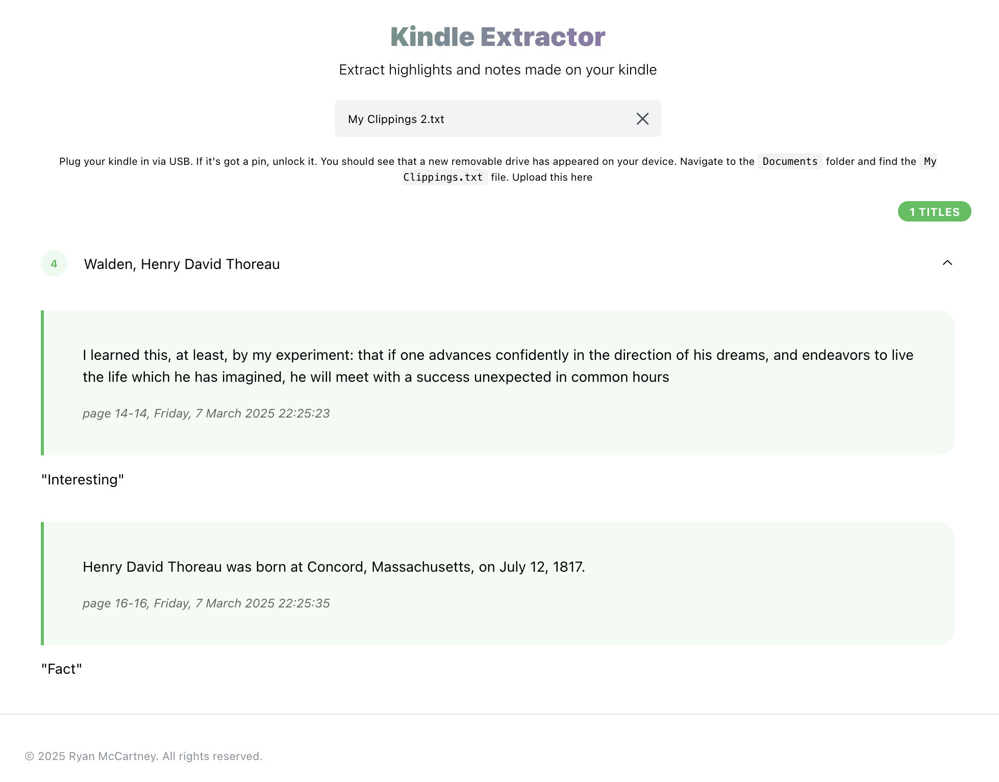

# Kindle Extractor

Upload your `My Clippings.txt` files and have them parsed. 

Built with React and Mantine. Runs entirely in your browser, no need to send your notes to someone else's service

Try it out at [ryan.mccartney.info/kindle-extractor](https://ryan.mccartney.info/kindle-extractor/).

## Todo

* Download notes for each book - Added in `v1.1.0`
* Upload a `.docx` and attempt to match highlights and notes to it, allow downloading again afterwards

## Development

* `git clone https://github.com/ryanmccartney/kindle-extractor`
* `cd ./kindle-extractor`
* `npm i`
* `npm run dev`

## Deploy

* `npm run build`
* `npm run deploy`
